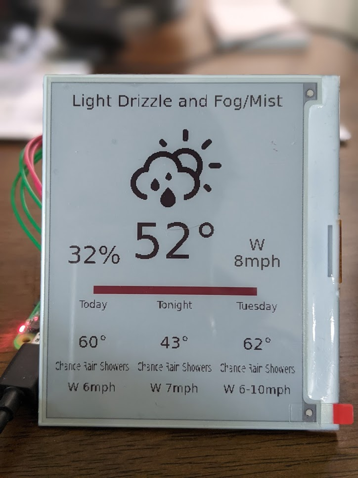
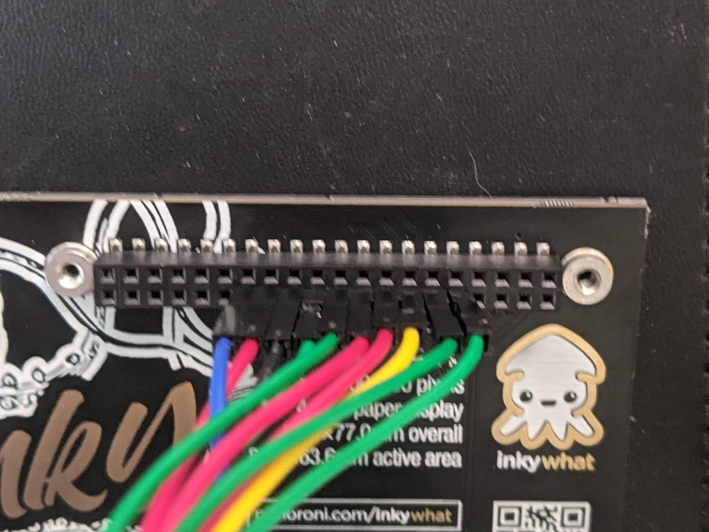
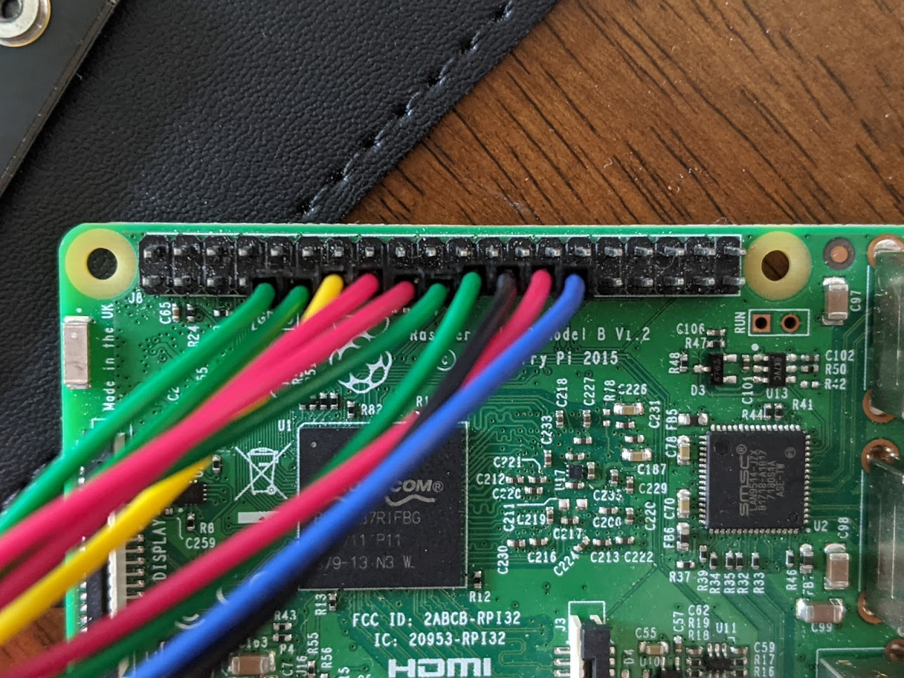
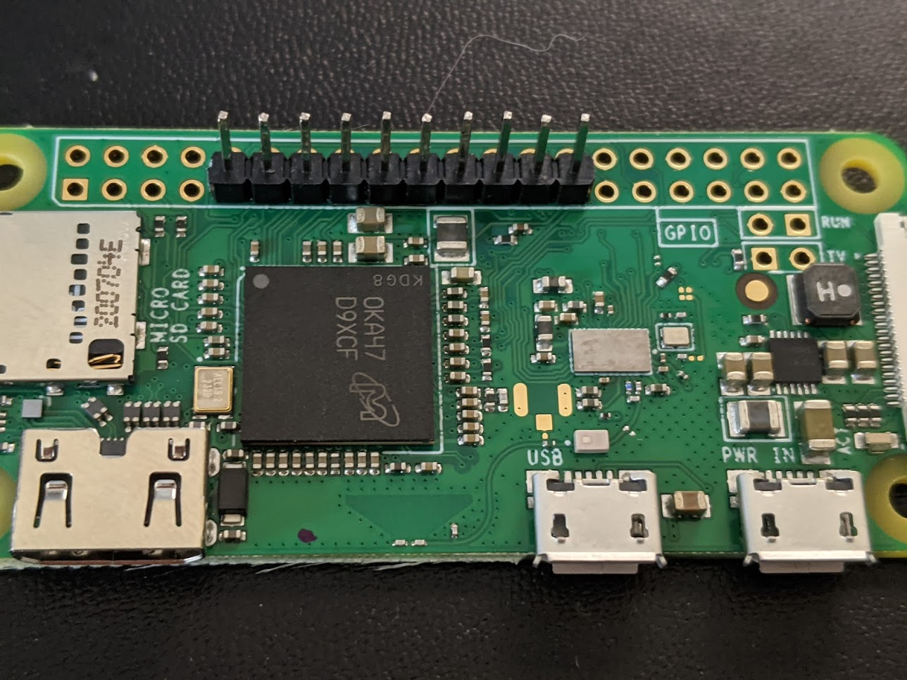

# Inky wHAT Weather Display and Screen Renderer

Display weather.gov observation and forecast information on an Inky wHAT e-ink screen

## Installation and Use

TL;DR: Decide where the image will be hosted. 
Find your nearest observation station, weather forecast office, and grid coordinates.
Run `WFO=<weather forcast office id> STATION=<station id> GRIDX=X GRIDY=Y node render.js` somewhere to get the PNG to display.
Host that image at `DISPLAY_URL`. Run `DISPLAY_URL=<image url> pyhton3 display.py` on the Raspi with the Inky attached. 

### Renderer

On the renderer, install:
- Dependencies: `sudo apt install imagemagick chromium-browser -y`
    - Imagemagick: binary executable doesn't work on raspi, else I'd just bundle that
    - Chromium: Needs to be at `/usr/bin/chromium-browser`. `npm` version I installed doens't work, else I'd just use default 
- `npm i` for the renderer dependencies
    - Puppeteer 
- Schedule `render.js` to be run at your update interval

`index.html` calls the NWS's API to get the most recent observation and upcoming forcast for the station, office, and grid defined in the query parameters, then writes that information to an HTML5 Canvas.
Puppeteer opens `index.html` with appropriate query parameters, gets the Canvas data, writes that full-fidelity PNG out to `screen.png`, then calls Imagemagick to convert it to the 3-color 888 PNG format the Inky expects as `display.png`.

### Display 

#### Software

- Enable SPI and GPIO
- Install Inky wHAT depenencies 
    - `pip3 install -r requirements.txt` 
    - [pimoroni/inky](https://github.com/pimoroni/inky) and [pillow](https://pillow.readthedocs.io/en/stable/) are the only Python packages you should need.
    - Some other random `apt` packages might need installed. It was little tricky first getting the display running. You'll get obvious errors for installation. 
- Schedule `display.py` to be run at your update interval

The client is minimal. 
`display.py` pulls a PNG from `DISPLAY_URL` and attempts to update the screen to the given image.
The image should be passed through Imagemagick to convert it to a 3-color PNG using the provided `palette.gif`, using `convert screen.png -dither none -remap palette.gif -rotate "90" display.png`.
I'm still working with dithering settings and font sizes best to display. 
`render.js` takes care of this. 

#### Hardware

The [pinouts I found](https://pinout.xyz/pinout/inky_phat) don't match with this [reference I was using](https://www.thingiverse.com/thing:3325556).
I used the reference and everything works for me.
This might be due to different Inky versions (EEPROM vs. no EEPROM) so your results may vary. 

## Built with

- [erikflowers/weather-icons](https://github.com/erikflowers/weather-icons)
- [National Weather Service's api.weather.gov](https://www.weather.gov/documentation/services-web-api)
- [Puppeteer](https://pptr.dev/)
- [Luxon](https://moment.github.io/luxon/)
- [pimoroni/inky](https://github.com/pimoroni/inky)
- [pillow](https://pillow.readthedocs.io/en/stable/)